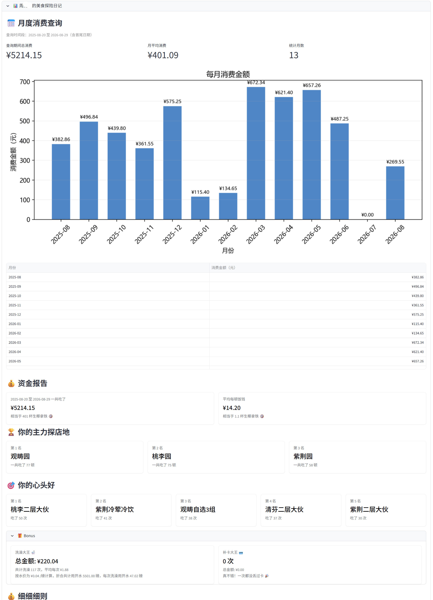
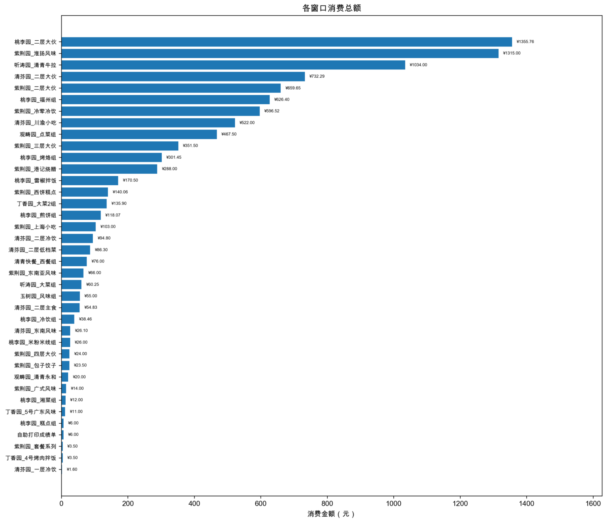
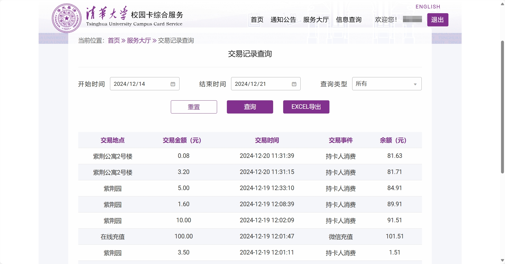
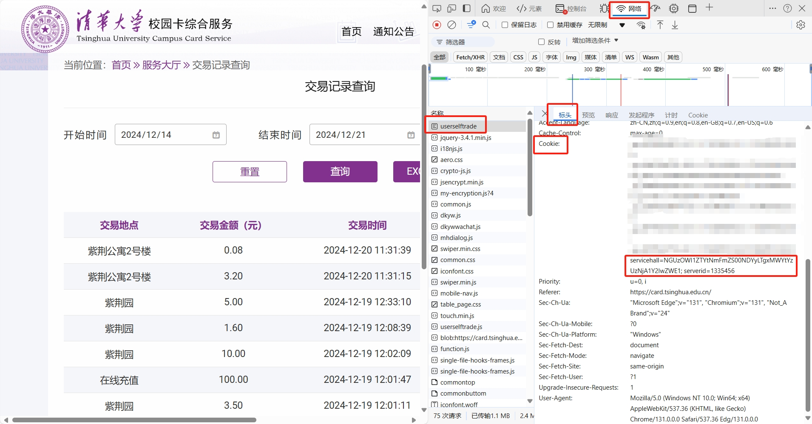

# THU-2025-Food

你在你清食堂里花的钱都花在哪儿了？

## 项目简介

> 本项目 Fork 自 [leverimmy/THU-Annual-Eat](https://github.com/leverimmy/THU-Annual-Eat) 、 [Huanshere/THU-2024-Food](https://github.com/Huanshere/THU-2024-Food)与[SphenHe/THU-202x-Food](https://github.com/SphenHe/THU-202x-Food)。
>
>更新内容如下：
> 1. 允许用户手动指定具体查询时间段，不再局限于某一整年；
> 2. 分别统计每个月的消费情况；
> 3. AI评论可选择关闭，同时预设多个常用供应商接口，并可创建多个配置；
> 4. 每次查询时会在本地保留记录，后续可使用前期保存的记录直接进行分析，而无需每次重新获取数据;
> 5. 在线查询可选择手动输入 `servicehall`，或输入统一身份认证账号密码，自动完成登录并获取 Cookie。
>
>为了确保您的隐私与数据安全，在此只建议**自行本地部署**或者**使用 [Release](https://github.com/c0d805e15c550432/THUFood/releases) 中打包好的版本**。
>
> 打包好的版本如下:
>
> - [Windows](https://github.com/c0d805e15c550432/THUFood/releases/latest/download/THU-Food-Summary-windows-latest.exe)
> - [MacOS](https://github.com/c0d805e15c550432/THUFood/releases/latest/download/THU-Food-Summary-macos-latest)
> - [Linux(Ubuntu)](https://github.com/c0d805e15c550432/THUFood/releases/latest/download/THU-Food-Summary-ubuntu-latest)。

本项目是一个用于统计清华大学学生在食堂（和宿舍）的消费情况的可视化工具。通过模拟登录清华大学校园卡网站，获取学生在食堂的消费记录，并通过数据可视化的方式展示。




### 选择认证方式

打开“在线获取数据”后，可选择：

- **账号密码登录（默认）**：通过学校统一身份认证账号和密码获取有效servicehall并查询数据；登录和查询成功后自动切换到手动模式，并回填学号与有效 `servicehall`。

  - 密码和验证码在提交后清空，不写入文件、不发送给 AI。二次验证成功后，程序请求将当前客户端设备设为可信；指纹和信任令牌通过 `keyring` 保存到当前操作系统用户的安全凭据库（Windows 使用 Credential Manager，macOS 使用 Keychain，桌面 Linux 使用 Secret Service 或 KWallet）。请仅在可信部署中输入认证信息。

  - 触发二次验证时支持企业邮箱验证码、短信验证码和 TOTP 三种模式。如果遇到其他尚未适配的交互验证，请手动获取servicehall，同时欢迎提交issue或pr。


- **手动输入 servicehall**：填写本人学号和按下面步骤获取的 Cookie 值。

### 手动获取servicehall

1. 打开[清华大学校园卡网站](https://card.tsinghua.edu.cn/userselftrade)并登录。



2. 按下 `F12` 打开开发者工具，切换到 Network（网络）标签页，然后 `Ctrl + R` 刷新页面，找到 `userselftrade` 这个请求，查看标头中的 `Cookie` 字段，其中包含了你的servicehall。

3. 复制 `servicehall=` **之后**的一串字符（不含 `servicehall=`）。




### AI 评论配置

侧边栏可保存并快速切换多套 AI 配置。内置 DeepSeek（首选）、OpenAI、Claude、Grok、Ollama、Gemini、千问、智谱、Kimi、MiniMax 和并行智算云预设；Base URL 与模型名称均可编辑。配置名称、接口和模型保存在用户配置目录，API Key 保存在系统安全凭据库，不写入配置 JSON 或日志。打开 AI 开关只会显示配置和评论区域；只有点击报告底部的“开始生成”按钮才会请求模型，普通页面刷新不会重复生成。模型名称可能随供应商更新，请以各平台当前控制台为准。

### 持久化目录


| 平台 | AI 配置 | 消费记录 |
|---|---|---|
| Windows | `%APPDATA%\THUFood\llm_profiles.json` | `%LOCALAPPDATA%\THUFood\eat_records` |
| macOS | `~/Library/Application Support/THUFood/llm_profiles.json` | `~/Library/Application Support/THUFood/eat_records` |
| Linux | `$XDG_CONFIG_HOME/THUFood/llm_profiles.json` | `$XDG_DATA_HOME/THUFood/eat_records` |

Linux 未设置 XDG 变量时，默认分别使用 `~/.config/THUFood` 和 `~/.local/share/THUFood`。如需便携部署，可以在真正的系统环境变量中设置 `THUFOOD_CONFIG_DIR` 和 `THUFOOD_DATA_DIR`；程序不再读取项目目录中的 `.env` 文件。


## 本地部署

你可以选择以下两种方式部署本项目：

### 方式一：使用 Conda

1. 下载源码
2. 创建并激活 conda 环境：
```bash
conda create -n thueat python=3.10.0
conda activate thueat
```

3. 安装依赖：
```bash
pip install -r requirements.txt
```

4. 运行应用：
```bash
streamlit run st.py
```
或双击start.bat(仅Windows)

AI 接口、模型和 API Key 均在侧边栏配置，无需创建 `.env`。更新已有环境后，需要重新执行 `pip install -r requirements.txt` 安装 `gmalg`、`keyring` 和 `platformdirs`。系统没有可用凭据库时仍可查询，但可信设备令牌和 AI Key 无法安全地跨重启保存。

### 方式二：使用 Docker

1. 下载源码

2. 构建并运行：
```bash
docker build -t ThuFood .
docker run -p 3000:3000 \
  -e THUFOOD_CONFIG_DIR=/data/config \
  -e THUFOOD_DATA_DIR=/data/files \
  -v thufood-data:/data \
  ThuFood
```

3. 访问 http://localhost:3000 即可使用。上述命名卷会持久保存非敏感配置和消费记录。普通无桌面容器通常没有系统凭据库，API Key 和可信设备令牌不会自动持久化；生产部署应连接外部密钥管理服务，或在每次容器会话中重新输入。

## LICENSE

除非另有说明，本仓库的内容采用 [CC BY-NC-SA 4.0](https://creativecommons.org/licenses/by-nc-sa/4.0/) 许可协议。在遵守许可协议的前提下，您可以自由地分享、修改本文档的内容，但不得用于商业目的。
